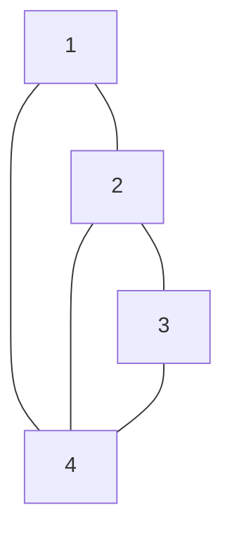
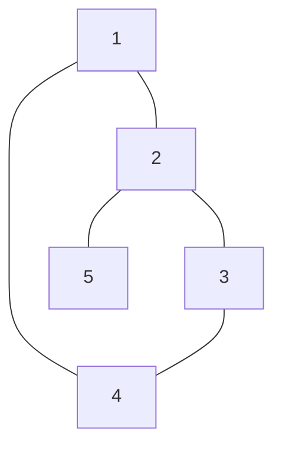

|        |                                       |
| ------ | ------------------------------------- |
| 날짜     | 2024-04-08                            |
| 사용 언어  | Java                                  |
| 문제 유형  | #dfs#graphs#graph_traversal#sorting   |
| 문제 URL | https://www.acmicpc.net/problem/24479 |


### 문제

###### 문제 설명


##### 제한사항


---
### 나의 풀이
```
예제 입력1 :
5 5 1
1 4
1 2
2 3
2 4
3 4

예제 출력1 :
1
2
3

0
```


```
반례 :
5 5 4  
1 4  
1 2  
2 3  
2 5  
3 4  
  
정답 :
2
3
4
1
5
```


```java
import java.io.BufferedReader;  
import java.io.IOException;  
import java.io.InputStreamReader;  
import java.util.ArrayList;  
import java.util.Collections;  
import java.util.Stack;  
import java.util.StringTokenizer;  
  
public class Main {  
    public static void main(String[] args) throws IOException {  
        BufferedReader br = new BufferedReader(new InputStreamReader(System.in));  
  
        StringTokenizer st = new StringTokenizer(br.readLine());  
  
        int N = Integer.parseInt(st.nextToken()); // 정점  
        int M = Integer.parseInt(st.nextToken()); // 간선  
        int start = Integer.parseInt(st.nextToken()); // 시작점  
  
        /** 무방향 그래프 **/  
        ArrayList<ArrayList<Integer>> graph = new ArrayList<>();  
        for (int i = 0; i <= N; i++) {  
            graph.add(new ArrayList<>());  
        }  
  
        for (int i = 0; i < M; i++) {  
            st = new StringTokenizer(br.readLine());  
  
            int a = Integer.parseInt(st.nextToken()); // 간선의 한 정점  
            int b = Integer.parseInt(st.nextToken()); // 간선의 다른 정덤  
  
            graph.get(a).add(b);  
            graph.get(b).add(a);  
        }  
  
        br.close();  
  
        /** dfs **/  
        // 노드를 저장 할 stack        Stack<Integer> stack = new Stack<>();  
        stack.push(start);  
  
        // 방문 순서를 저장할 배열  
        int[] visitOrder = new int[N + 1];  
  
        // 방문 여부를 저장 할 배열  
        boolean[] visited = new boolean[N + 1];  
  
        // 시작 정점에 방문  
        visited[start] = true;  
        int order = 1;  
  
        while (!stack.isEmpty()) {  
            int vertex = stack.pop();  
            // 방문 할 때 마다 카운트 증가  
            visitOrder[vertex] = order++;  
            // 인접 정점은 오름차순으로 방문해야 하기 때문에 정렬  
            Collections.sort(graph.get(vertex));  
  
            // 꺼낸 정점과 연결 된 정점 탐색  
            for (int next : graph.get(vertex)) {  
                if (!visited[next]) {  
                    stack.push(next);  
                    visited[next] = true;  
                }  
            }  
        }  
  
        /** 출력 **/  
        StringBuilder sb = new StringBuilder();  
        // 1부터 시작이므로 기본 for 문 사용  
        for (int i = 1; i <= N; i++) {  
            sb.append(visitOrder[i]).append("\n");  
        }  
  
        System.out.println(sb);  
    }  
}
```


### 다른 사람의 풀이

```java

```

---
### 관련개념 학습
