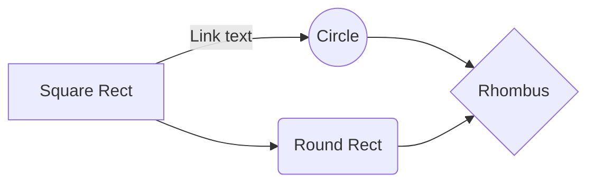
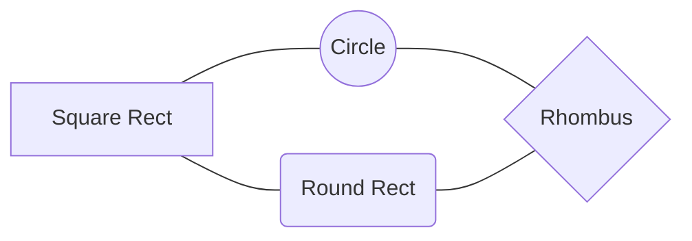
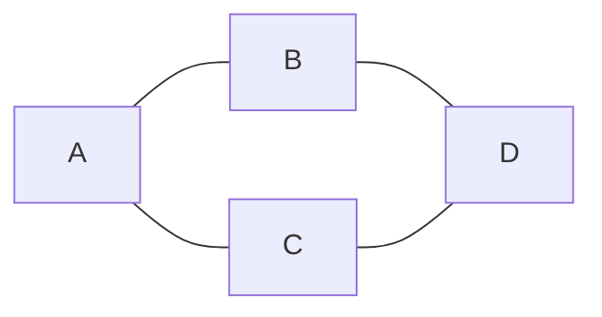

graph LR
    A[Square Rect] -- Link text --> B((Circle))
    A --> C(Round Rect)
    B --> D{Rhombus}
    C --> D

```mermaid
graph LR
    A[Square Rect] -- Link text --> B((Circle))
    A --> C(Round Rect)
    B --> D{Rhombus}
    C --> D

```

```mermaid
graph LR
    A[Square Rect] --- B((Circle))
    A --- C(Round Rect)
    B --- D{Rhombus}
    C --- D

```

```mermaid
graph LR
    A --- B
    A --- C
    B --- D
    C --- D

```

