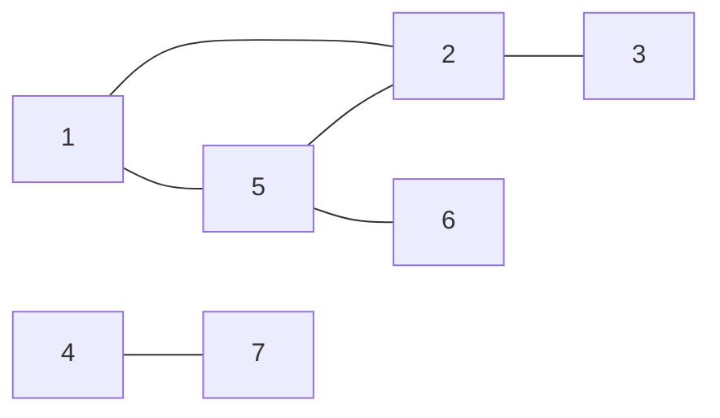

### (인강) 그래프 DFS/BFS
#### DFS 깊이 우선 탐색

- 한 방향으로 최대한 깊이 들어가 탐색
- stack 혹은 재귀 사용

- 출력

``` java
public static void dfs(int[][] graph,  
                       boolean[] visited,  
                       int start) {  
    Stack<Integer> stack = new Stack<>();  
    stack.push(start);  
    visited[start] = true;  
    System.out.println(start);  
  
    while (!stack.isEmpty()) {  
        int vertex = stack.pop();  
  
        for (int i = 1; i < graph.length; i++) {  
            if (graph[vertex][i] == 1 && !visited[i]) {  
                stack.push(i);  
                visited[i] = true;  
                System.out.println(i);  
            }  
        }  
    }  
}
```

#### BFS 너비 우선 탐색

- 같은 깊이의 정점을 우선 탐색
- queue 사용
- 최단 거리 문제에서 활용

```java
public static void bfs(int[][] graph,
				   boolean[] visited,
				   int start) {
	Queue<Integer> queue = new LinkedList<>();
	queue.offer(start);
	visited[start] = true; // 시작 정점을 방문했다고 표시

	while (!queue.isEmpty()) {
		int vertex = queue.poll();

		// 현재 정점과 인접한 모든 정점을 확인
		for (int i = 1; i < graph.length; i++) {
			// 인접하고 아직 방문하지 않은 정점이 있다면
			if (graph[vertex][i] == 1 && !visited[i]) {
				visited[i] = true; // 해당 정점을 방문했다고 표시
				queue.offer(i); // 큐에 추가
			}
		}
	}
}
```

##### 연습 문제
- DFS - [2606번: 바이러스](Coding%20Test/2024/24.04/2주차/B2606-바이러스)
- BFS - [2178번: 미로탐색](Coding%20Test/2024/24.04/2주차/B2178-미로탐색)

---
### 오늘의 과제
1. [24479번: 알고리즘 수업 - 깊이 우선 탐색 1](Coding%20Test/2024/24.04/2주차/B24479%20깊이%20우선%20탐색%201.md)
2. [24444번: 알고리즘 수업 - 너비 우선 탐색 1](Coding%20Test/2024/24.04/2주차/B24444-너비%20우선%20탐색%201)
3. [10026번: 적록색약](Coding%20Test/2024/24.04/2주차/B10026-적록색약)
4. [7562번: 나이트의 이동](Coding%20Test/2024/24.04/2주차/B7562-나이트의%20이동)
5. [16928번: 뱀과 사다리 게임](Coding%20Test/2024/24.04/2주차/B16928-뱀과%20사다리%20게임)
6. [7569번: 토마토](Coding%20Test/2024/24.04/2주차/B7569-토마토)
7. [3055번: 탈출](Coding%20Test/2024/24.04/2주차/B3055-탈출)
8. [2206번: 벽 부수고 이동하기](Coding%20Test/2024/24.04/2주차/B2206-벽%20부수고%20이동하기)

---
마지막 정리
---
#### Q. 오늘 진행된 강의에서 학습한 내용은 무엇인가요?
- 

#### Q. 이번 주 진행된 팀 스터디에서 얻은 인사이트는 무엇인가요?
- 최단거리나 그래프 등은 대부분 BFS
- DFS, BFS는 일단 템플릿 기반으로 많이 풀어서 익숙해지는 것도 좋다.


---
**항해99 취업 리부트 코스를 수강하고 작성한 콘텐츠 입니다.**

[https://hanghae99.spartacodingclub.kr/reboot](https://hanghae99.spartacodingclub.kr/reboot)

#개발자포트폴리오 #개발자이력서 #개발자취업 #개발자취준 #코딩테스트 #항해99 #취리코 #취업리부트코스 #재취업

